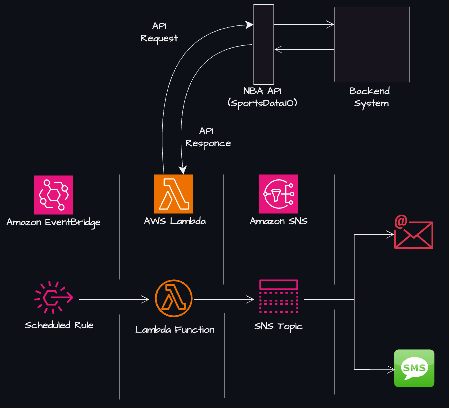
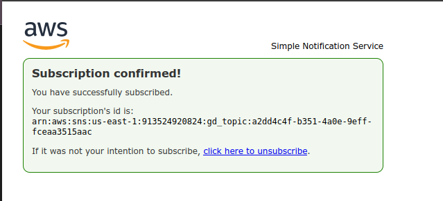
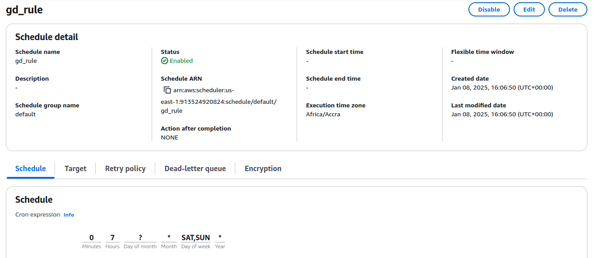
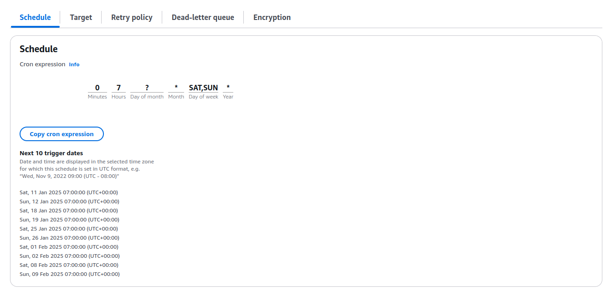
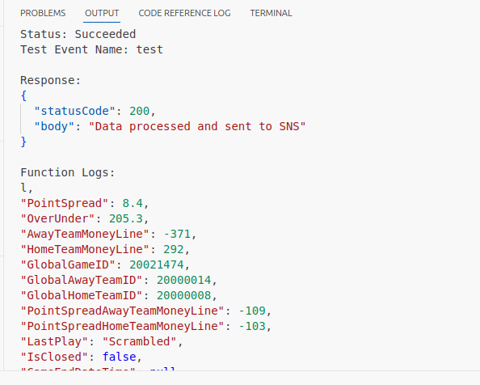
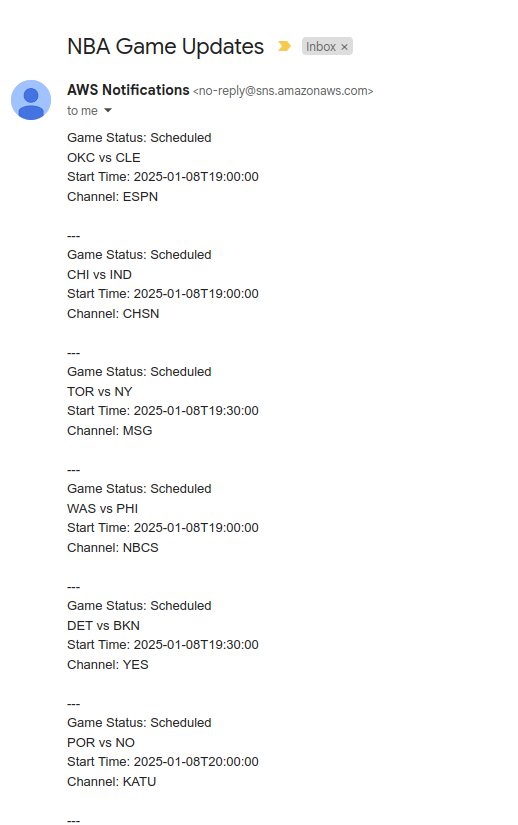

# NBA Game Day Notifications / Sports Alerts System

## **Project Overview**
This project is a cloud-based notification system that sends **real-time NBA game updates** to subscribed users via SMS and Email. It utilizes **Amazon SNS**, **AWS Lambda**, **Amazon EventBridge**, and the **NBA Game API** to provide sports fans with live game updates. This project demonstrates how to design scalable and efficient notification systems using cloud computing.

---

## **Features**
- Fetches live NBA game details and scores via an external API.
- Sends formatted alerts to users via **Amazon SNS** through SMS/Email.
- Automates notifications using **Amazon EventBridge** with cron-based scheduling.
- Adheres to **least privilege IAM policies** for enhanced security.

---

## **Visual Overview**
Here’s an architectural diagram of the system workflow:



---

## **Prerequisites**
- A free account with API access from [SportsData.io](https://sportsdata.io/).
- An AWS account with access to Lambda, SNS, and EventBridge.
- Familiarity with Python programming and basic AWS services.

---

## **Technologies Used**
- **Cloud Provider**: AWS
- **Key Services**: SNS, Lambda, EventBridge
- **Programming Language**: Python 3.x
- **External API**: NBA Game API (SportsData.io)
- **IAM Security**:  
  - Least privilege policies for AWS Lambda, SNS, and EventBridge.

---

## **Project Directory Structure**
```plaintext
game-day-notifications/
├── src/
│   ├── lambda_function.py        # Main Lambda function
├── images/
├── policies/
│   ├── sns_policy.json         # SNS publishing permissions
├── .gitignore
└── README.md                      # Documentation
```

---

# Getting Started

## **Step 1: Create an SNS Topic**
1. Navigate to the **SNS service** in the AWS Management Console.
2. Click on **Create Topic** and select the **Standard** type for the topic.
3. Enter a name for the topic (e.g., `nba_notifications`) and save the **ARN** for later use.
4. Add subscriptions to the topic:
   - **For Email**: Enter a valid email address in the subscription form.
   - **For SMS**: Enter a phone number in the international format (e.g., `+1234567890`).
5. For email subscriptions, check your inbox and confirm the subscription by clicking the confirmation link sent to your email.

### **Example: SNS Subscription Confirmation**
Below is an example of the subscription confirmation process in the AWS SNS Console:




---

## **Step 2: Set Up IAM Roles and Policies**
1. Open the **IAM service** in AWS.
2. Create a policy for publishing SNS messages (e.g., `gd_sns_policy.json`).
3. Assign the policy to a new **IAM role** for **Lambda execution**.
4. Attach the managed policy `AWSLambdaBasicExecutionRole` to the same role.

---

## **Step 3: Deploy the Lambda Function**
1. In the **AWS Lambda Console**, create a new function and select **Author from Scratch**.
2. Assign the **IAM role** created earlier.
3. Paste the code from `src/lambda_function.py` into the editor.
4. Add the following environment variables:
   - `NBA_API_KEY`: Your SportsData.io API key.
   - `SNS_TOPIC_ARN`: The ARN of your SNS topic.

---

## **Step 4: Automate with Amazon EventBridge**
1. Navigate to the **EventBridge service** in the AWS Management Console.
2. Create a new rule with a **Schedule** as the event source.
3. Use a **cron expression** to define the schedule (e.g., `0 7 ? * SAT *` for Saturday at 7 AM).
4. Add the **Lambda function** (`gd_notifications`) as the target for the rule.

Here are examples of the **EventBridge Rule Creation** process:





---

## **Testing the System**
1. Navigate to the **AWS Lambda Console** and create a test event with mock data to simulate a game update.
2. Trigger the Lambda function and validate the following:
   - **CloudWatch Logs**: Check for error messages or execution details to ensure the function ran successfully.
   - **SNS Notifications**: Confirm that alerts are delivered via Email and/or SMS.

Here are example screenshots from the testing process:

### **Lambda Test Execution**


### **Email Notification Example**

